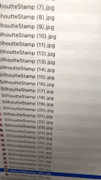

# Sillhoutte Stamp

I want to create an interactive experience that resembles an ink stamp, but with one's body shape.

## Summary 

Shadow Stamp is an interactive experience that reimagines how we behave in public spaces; integrating play into public spaces. 
Passers-by will be detected, and their bodies will be represented by different colors. If they stay in a position for longer
than 3 seconds, their bodies and colors, will be stamped onto the projection. The colors of the stamped shadows will be darker
than the ones that are not; to differentiate the two. 

The main goal is to have people stop, and instead of being guarded in their environment, feel comfortable and playful,
and maybe even play with other strangers.

## Component Parts

Hardware: Camera

Software: p5.js / ml5.js

## Challenges

1. Timer/Capture
I foresee needing a timer and capture state (like a self-timer camera), but these are things I've never touched or done
before. If it's a high-traffic area, how does it detect which person to capture? Or can it capture both people?  

2. When to reset/show
When the body shapes are stamped, I wonder what I need to ensure they stay projected, and only disappear (or reset),
after the projection has more than 10 body shapes.

## Timeline

Week 1: Write proposal. Get Posenet working — 1. Detect bodies. 2. Attach shapes on bodies.

Week 2: Build timer/capture aspect on to the experience.

Week 3: Make sure canvas resets after 10 stamps.

Week 4: Present

# Final Outcome

View here: https://editor.p5js.org/natkasman/sketches/reB8_ofKA

## Reflections

BodyPix made it so much easier! I thought I was going to spend a huge chunk of my time trying to create the shapes for each individual body parts, but BodyPix saved all that time for me. What was unexpected was spending a chunk of time trying to figure out how to incorporate the timer to my sketch — primarily because the base code didn't have a draw() – which was something I'm not familiar with. Another challenge was trying to implement the timer code I had (I did it separately) and stitch it to my main sketch. Initially, because I had set the sketch to be automatically downloaded when the timer reaches 0:00, it kept on downloading and FLOODED MY DOWNLOADS FOLDER. I quickly learned that I needed to add booleans/states to solve that problem. (I had initially thought just setInterval would suffice).

My original idea was to have it capture people who are standing still, but with the time I had, I chose to focus on creating something functional that conveys the main idea I have. Overall pleased with the results :)
